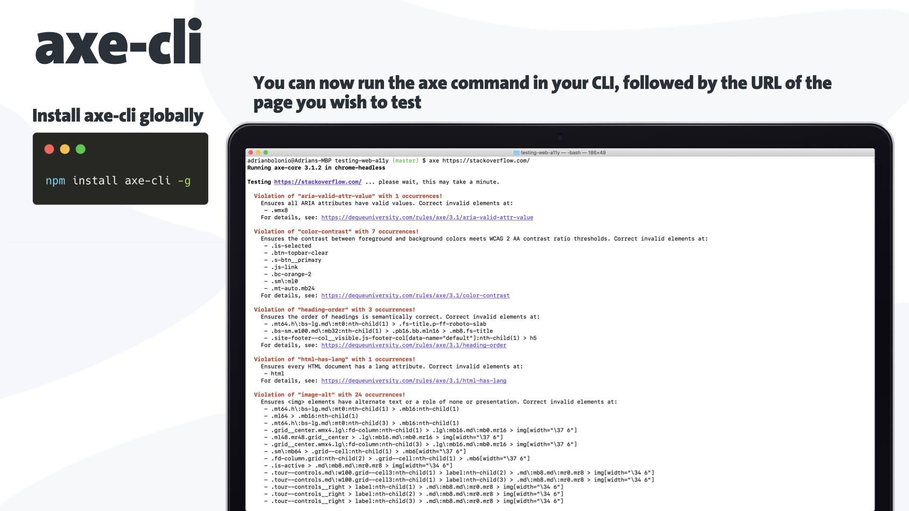
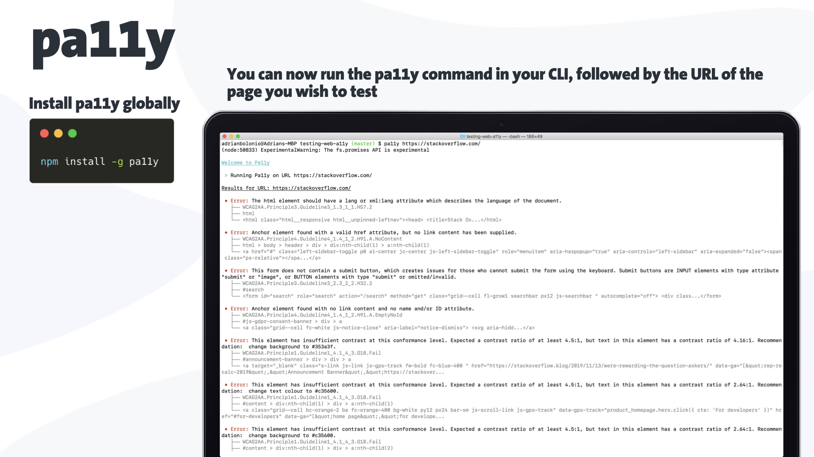
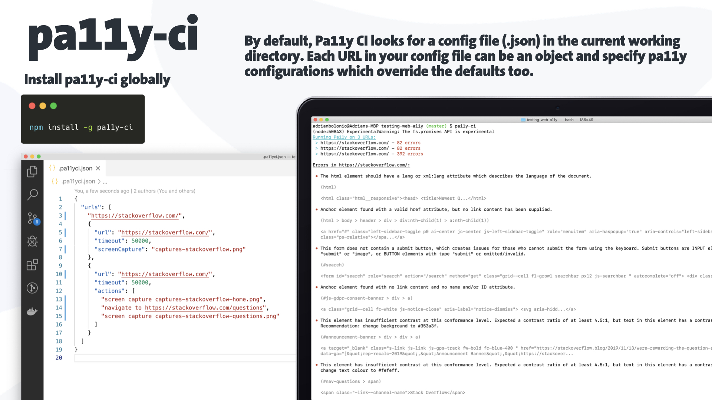
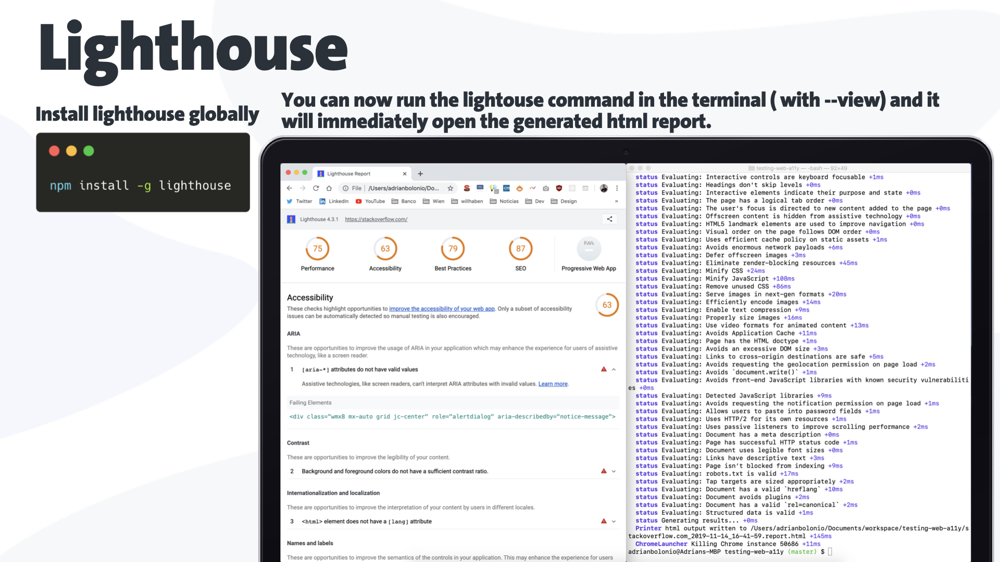

Sometimes we, as developers, inherit and old codebase, or we join a project where no one took care of web accessibility tests. In those situations, you would maybe want to test the whole DOM structure of the application.

## Testing Web Accessibility (a11y)

I've created a series of three blog posts to give to give you an introduction about the tools that I usually use to test accessibility during my development process:

[Testing Web Accessibility - Part 1 - Testing the code](/testing-web-accessibility-part-1)

Testing Web Accessibility - Part 2 - Testing the DOM

[Testing Web Accessibility - Part 3 - Testing in the browser](/testing-web-accessibility-part-3)

## Testing Web Accessibility - Part 2 - Testing the DOM

Sometimes we, as developers, inherit and old codebase, or we join a project where no one took care of web accessibility tests.
In those situations, you would maybe want to test the whole DOM structure of the application.

Let me show you some tools that can help you with that:

### A command line interface for axe to run quick accessibility tests

Another excellent tool from the axe tool family is [@axe-core/cli](https://github.com/dequelabs/axe-core-npm/tree/develop/packages/cli).
@axe-core/cli provides a command line interface for axe to run quick accessibility tests.

To start using it, you need to install it globally.

```bash
$ npm install -g @axe-core/cli
```

You can now run the axe command in your terminal, followed by the URL of the page you wish to test. Here it is a quick example:

```bash
$ axe http://www.adrianbolonio.com
```

Similar to what I told you in the first part of the series with react-axe, each violation includes the description of the issue, the HTML element in where the violation was found, and a link to the [dequeuniversity](https://dequeuniversity.com/), a full documentation source with detailed information about the issue, and the steps to solve it.
Several ocurrences of the same violation are grouped.



You can use the `--rules` flag to set which rules you wish to run, or you can use `--tags` to tell axe to run all rules that have that specific tag. For example:

```bash
$ axe http://www.adrianbolonio.com --rules color-contrast,html-has-lang
```

Or, to run all wcag2a rules:

```bash
$ axe http://www.adrianbolonio.com --tags wcag2a
```

Results can be saved as JSON data, using the `--save` and `--dir` flags. By passing a filename to --save you indicate how the file should be called. If no filename is passed, a default will be used.

If you are having difficulty with the color scheme, use `--no-color` to disable text styles.

### Another command line interface to run accessibility tests

Another similar tool is [pa11y](http://pa11y.org/), a command line interface which loads web pages and highlights any accessibility issues it finds.
Useful for when you want to run a one-off test against a web page.
It runs accessibility tests on your pages via the command line or Node.js, so you can automate your testing process.

To start using it, you need to install it globally.

```bash
$ npm install -g pa11y
```

You can now run the pa11y command in your terminal, followed by the URL of the page you wish to test. Here it is a quick example:

```bash
$ pa11y http://www.adrianbolonio.com
```



It could be quite tedious to test one url at a time, so the interesting thing of the pa11y library is its CI-centric accessibility test runner.
The CI runs accessibility tests against multiple URLs and reports on any issues.
This is best used during automated testing of your application and can act as a gatekeeper to stop a11y issues from making it to live.

One interesting feature is that the CI can run actions before pa11y tests the page.
Actions are additional interactions that you can make pa11y perform before the tests are run.
They allow you to do things like click on a button, enter a value in a form, wait for a redirect, or wait for the URL fragment to change.



### Lighthouse, an open-source, automated tool for improving the quality of web pages

[Lighthouse](https://developers.google.com/web/tools/lighthouse/) is a tool developed by Google, and it's included in the Chrome DevTools, but you can as well execute it from the terminal.
Google define it as an open-source, automated tool for improving the quality of web pages.
You can run it against any web page, public or requiring authentication.
It has audits for performance, accessibility, progressive web apps, SEO and more.

To start using it, you need to install it globally.

```bash
$ npm install -g lighthouse
```

You can now run the lighthouse command in your terminal, followed by the URL of the page you wish to test.
Adding the `--view` flags will immediately open the generated html report.
Here it is a quick example:

```bash
$ lighthouse http://www.adrianbolonio.com --view
```



You can use the `--output-path` flag to specify an output path to save the results into a json or a CSV file, that can be use for reporting purposes.

```bash
$ lighthouse http://adrianbolonio.com/ --output-path result.json
```

In the next post I will show you some of the manual testing tools to test web accessibility from the browser.

You can read the rest of the series of three blog posts here:

[Testing Web Accessibility - Part 1 - Testing the code](/testing-web-accessibility-part-1)

Testing Web Accessibility - Part 2 - Testing the DOM

[Testing Web Accessibility - Part 3 - Testing in the browser](/testing-web-accessibility-part-3)
